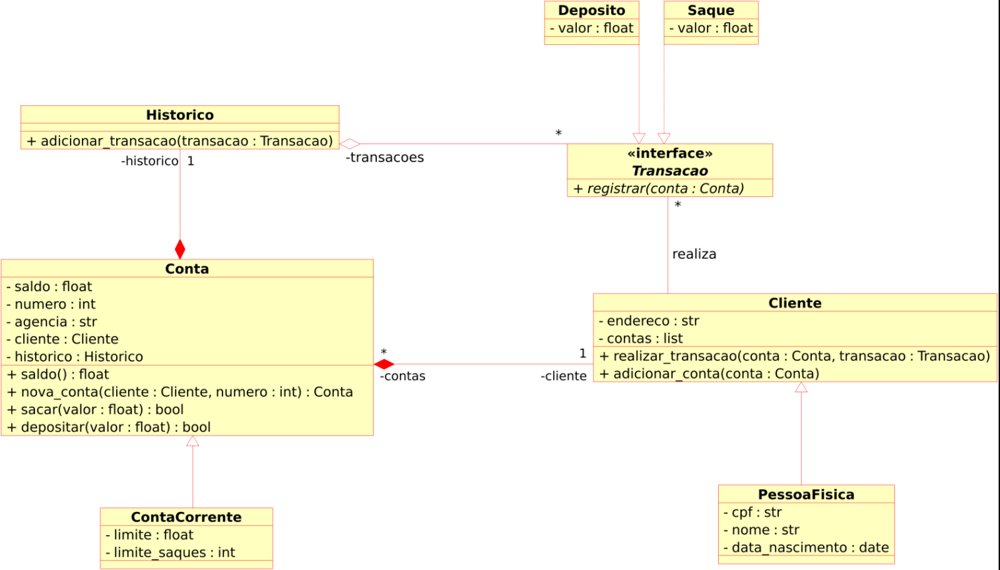

# equipes-banco
Exemplo de desenvolvimento em equipe

## Objetivos

- O objetivo geral é iniciar A modelagem no sistema bancário em programação orientada a objetos e adicionar classes para cliente e as operações bancárias depósito e saque.
- O que precisamos fazer é atualizar a implementação do sistema bancário para armazenar os dados de clientes e contas bancárias em objetos ao invés de dicionários.
- O código deve seguir o modelo UML de classes a seguir:

## Classe conta

A classe conta deve ter:

- saldo;
- número;
- agência;
- cliente;
- e histórico;

Todos como atributos da classe e eles são privados (sinal de menos)

- 4 métodos:
- saldo - não recebe nenhum argumento ele retorna float;
nova conta - é um método que cria uma conta (método de fábrica) então ele vai receber um cliente e o número da conta que pode ser um temporário, e tem retornar o objeto contra;
- a operação de sacar - recebe um valor que é float e retorna um boleano;
- e o depositar recebe um valor que é float e retorna boleano, para que se a operação aconteceu com sucesso ou falha retorna True se deu certo sacar, e caso se não depositar retorna falso, se deu errado e não depositar, por falso se deu errado também.
