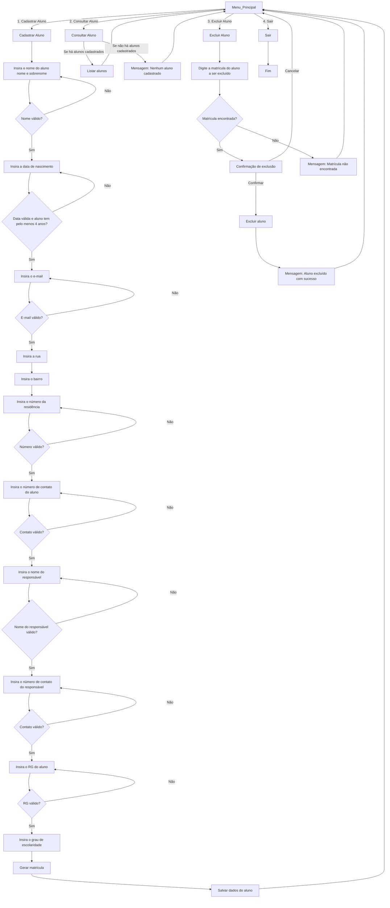

# Os-Anonimos

Matrícula do Aluno (README)

1.Esse programa realiza uma matrícula, consúlta e exclusão de alunos de uma lista, coletando seus dados e os dados do seu responsável.

1.1. Matrícula de Alunos.
Ao matrícular o aluno é inserido o nome, data de nascimento, email, contato, rua, bairro e número de residência, nome do responsável e contato do responsável, RG do aluno, grau de escolaridade. Seus dados
são salvos e é gerado uma matrícula de 10 dígitos de acordo com o ano, mês e ordem de matrícula no mês e ano.

1.2. Consulta de Alunos.
Com a matrícula que é gerada ao matricular o aluno, você poderá ter a opção de consultar todas as informações do aluno, somente os dados do responsável ou ver a lista de todos os alunos com o nome e matrícula.

1.3. Excluir Alunos.
Você poderá pesquisar o aluno que deseja excluir com o uso da matrícula do mesmo. Ao inserir a matrícula o programa retornará com uma pergunta para confirmação da exclusão do aluno, mostrando seu nome e matrícula.
Caso o usuário queira confirmar a exclusão deve digitar "s" e teclar "Enter", caso deseje cancelar será necessário apenas declar "Enter".

%3CmxGraphModel%3E%3Croot%3E%3CmxCell%20id%3D%220%22%2F%3E%3CmxCell%20id%3D%221%22%20parent%3D%220%22%2F%3E%3CmxCell%20id%3D%222%22%20value%3D%22Aluno%22%20style%3D%22shape%3Dtable%3BstartSize%3D30%3Bcontainer%3D1%3Bcollapsible%3D1%3BchildLayout%3DtableLayout%3BfixedRows%3D1%3BrowLines%3D0%3BfontStyle%3D1%3Balign%3Dcenter%3BresizeLast%3D1%3Bhtml%3D1%3B%22%20vertex%3D%221%22%20parent%3D%221%22%3E%3CmxGeometry%20x%3D%2290%22%20y%3D%22670%22%20width%3D%22330%22%20height%3D%22300%22%20as%3D%22geometry%22%2F%3E%3C%2FmxCell%3E%3CmxCell%20id%3D%223%22%20value%3D%22%22%20style%3D%22shape%3DtableRow%3Bhorizontal%3D0%3BstartSize%3D0%3BswimlaneHead%3D0%3BswimlaneBody%3D0%3BfillColor%3Dnone%3Bcollapsible%3D0%3BdropTarget%3D0%3Bpoints%3D%5B%5B0%2C0.5%5D%2C%5B1%2C0.5%5D%5D%3BportConstraint%3Deastwest%3Btop%3D0%3Bleft%3D0%3Bright%3D0%3Bbottom%3D1%3B%22%20vertex%3D%221%22%20parent%3D%222%22%3E%3CmxGeometry%20y%3D%2230%22%20width%3D%22330%22%20height%3D%2230%22%20as%3D%22geometry%22%2F%3E%3C%2FmxCell%3E%3CmxCell%20id%3D%224%22%20value%3D%22PK%22%20style%3D%22shape%3DpartialRectangle%3Bconnectable%3D0%3BfillColor%3Dnone%3Btop%3D0%3Bleft%3D0%3Bbottom%3D0%3Bright%3D0%3BfontStyle%3D1%3Boverflow%3Dhidden%3BwhiteSpace%3Dwrap%3Bhtml%3D1%3B%22%20vertex%3D%221%22%20parent%3D%223%22%3E%3CmxGeometry%20width%3D%2230%22%20height%3D%2230%22%20as%3D%22geometry%22%3E%3CmxRectangle%20width%3D%2230%22%20height%3D%2230%22%20as%3D%22alternateBounds%22%2F%3E%3C%2FmxGeometry%3E%3C%2FmxCell%3E%3CmxCell%20id%3D%225%22%20value%3D%22IDAluno%22%20style%3D%22shape%3DpartialRectangle%3Bconnectable%3D0%3BfillColor%3Dnone%3Btop%3D0%3Bleft%3D0%3Bbottom%3D0%3Bright%3D0%3Balign%3Dleft%3BspacingLeft%3D6%3BfontStyle%3D5%3Boverflow%3Dhidden%3BwhiteSpace%3Dwrap%3Bhtml%3D1%3B%22%20vertex%3D%221%22%20parent%3D%223%22%3E%3CmxGeometry%20x%3D%2230%22%20width%3D%22150%22%20height%3D%2230%22%20as%3D%22geometry%22%3E%3CmxRectangle%20width%3D%22150%22%20height%3D%2230%22%20as%3D%22alternateBounds%22%2F%3E%3C%2FmxGeometry%3E%3C%2FmxCell%3E%3CmxCell%20id%3D%226%22%20value%3D%22int%22%20style%3D%22shape%3DpartialRectangle%3Bconnectable%3D0%3BfillColor%3Dnone%3Btop%3D0%3Bleft%3D0%3Bbottom%3D0%3Bright%3D0%3Balign%3Dleft%3BspacingLeft%3D6%3BfontStyle%3D5%3Boverflow%3Dhidden%3BwhiteSpace%3Dwrap%3Bhtml%3D1%3B%22%20vertex%3D%221%22%20parent%3D%223%22%3E%3CmxGeometry%20x%3D%22180%22%20width%3D%22150%22%20height%3D%2230%22%20as%3D%22geometry%22%3E%3CmxRectangle%20width%3D%22150%22%20height%3D%2230%22%20as%3D%22alternateBounds%22%2F%3E%3C%2FmxGeometry%3E%3C%2FmxCell%3E%3CmxCell%20id%3D%227%22%20value%3D%22%22%20style%3D%22shape%3DtableRow%3Bhorizontal%3D0%3BstartSize%3D0%3BswimlaneHead%3D0%3BswimlaneBody%3D0%3BfillColor%3Dnone%3Bcollapsible%3D0%3BdropTarget%3D0%3Bpoints%3D%5B%5B0%2C0.5%5D%2C%5B1%2C0.5%5D%5D%3BportConstraint%3Deastwest%3Btop%3D0%3Bleft%3D0%3Bright%3D0%3Bbottom%3D0%3B%22%20vertex%3D%221%22%20parent%3D%222%22%3E%3CmxGeometry%20y%3D%2260%22%20width%3D%22330%22%20height%3D%2230%22%20as%3D%22geometry%22%2F%3E%3C%2FmxCell%3E%3CmxCell%20id%3D%228%22%20value%3D%22%22%20style%3D%22shape%3DpartialRectangle%3Bconnectable%3D0%3BfillColor%3Dnone%3Btop%3D0%3Bleft%3D0%3Bbottom%3D0%3Bright%3D0%3Beditable%3D1%3Boverflow%3Dhidden%3BwhiteSpace%3Dwrap%3Bhtml%3D1%3B%22%20vertex%3D%221%22%20parent%3D%227%22%3E%3CmxGeometry%20width%3D%2230%22%20height%3D%2230%22%20as%3D%22geometry%22%3E%3CmxRectangle%20width%3D%2230%22%20height%3D%2230%22%20as%3D%22alternateBounds%22%2F%3E%3C%2FmxGeometry%3E%3C%2FmxCell%3E%3CmxCell%20id%3D%229%22%20value%3D%22nome%22%20style%3D%22shape%3DpartialRectangle%3Bconnectable%3D0%3BfillColor%3Dnone%3Btop%3D0%3Bleft%3D0%3Bbottom%3D0%3Bright%3D0%3Balign%3Dleft%3BspacingLeft%3D6%3Boverflow%3Dhidden%3BwhiteSpace%3Dwrap%3Bhtml%3D1%3B%22%20vertex%3D%221%22%20parent%3D%227%22%3E%3CmxGeometry%20x%3D%2230%22%20width%3D%22150%22%20height%3D%2230%22%20as%3D%22geometry%22%3E%3CmxRectangle%20width%3D%22150%22%20height%3D%2230%22%20as%3D%22alternateBounds%22%2F%3E%3C%2FmxGeometry%3E%3C%2FmxCell%3E%3CmxCell%20id%3D%2210%22%20value%3D%22text%22%20style%3D%22shape%3DpartialRectangle%3Bconnectable%3D0%3BfillColor%3Dnone%3Btop%3D0%3Bleft%3D0%3Bbottom%3D0%3Bright%3D0%3Balign%3Dleft%3BspacingLeft%3D6%3Boverflow%3Dhidden%3BwhiteSpace%3Dwrap%3Bhtml%3D1%3B%22%20vertex%3D%221%22%20parent%3D%227%22%3E%3CmxGeometry%20x%3D%22180%22%20width%3D%22150%22%20height%3D%2230%22%20as%3D%22geometry%22%3E%3CmxRectangle%20width%3D%22150%22%20height%3D%2230%22%20as%3D%22alternateBounds%22%2F%3E%3C%2FmxGeometry%3E%3C%2FmxCell%3E%3CmxCell%20id%3D%2211%22%20value%3D%22%22%20style%3D%22shape%3DtableRow%3Bhorizontal%3D0%3BstartSize%3D0%3BswimlaneHead%3D0%3BswimlaneBody%3D0%3BfillColor%3Dnone%3Bcollapsible%3D0%3BdropTarget%3D0%3Bpoints%3D%5B%5B0%2C0.5%5D%2C%5B1%2C0.5%5D%5D%3BportConstraint%3Deastwest%3Btop%3D0%3Bleft%3D0%3Bright%3D0%3Bbottom%3D0%3B%22%20vertex%3D%221%22%20parent%3D%222%22%3E%3CmxGeometry%20y%3D%2290%22%20width%3D%22330%22%20height%3D%2220%22%20as%3D%22geometry%22%2F%3E%3C%2FmxCell%3E%3CmxCell%20id%3D%2212%22%20value%3D%22%22%20style%3D%22shape%3DpartialRectangle%3Bconnectable%3D0%3BfillColor%3Dnone%3Btop%3D0%3Bleft%3D0%3Bbottom%3D0%3Bright%3D0%3Beditable%3D1%3Boverflow%3Dhidden%3BwhiteSpace%3Dwrap%3Bhtml%3D1%3B%22%20vertex%3D%221%22%20parent%3D%2211%22%3E%3CmxGeometry%20width%3D%2230%22%20height%3D%2220%22%20as%3D%22geometry%22%3E%3CmxRectangle%20width%3D%2230%22%20height%3D%2220%22%20as%3D%22alternateBounds%22%2F%3E%3C%2FmxGeometry%3E%3C%2FmxCell%3E%3CmxCell%20id%3D%2213%22%20value%3D%22data_nascimento%22%20style%3D%22shape%3DpartialRectangle%3Bconnectable%3D0%3BfillColor%3Dnone%3Btop%3D0%3Bleft%3D0%3Bbottom%3D0%3Bright%3D0%3Balign%3Dleft%3BspacingLeft%3D6%3Boverflow%3Dhidden%3BwhiteSpace%3Dwrap%3Bhtml%3D1%3B%22%20vertex%3D%221%22%20parent%3D%2211%22%3E%3CmxGeometry%20x%3D%2230%22%20width%3D%22150%22%20height%3D%2220%22%20as%3D%22geometry%22%3E%3CmxRectangle%20width%3D%22150%22%20height%3D%2220%22%20as%3D%22alternateBounds%22%2F%3E%3C%2FmxGeometry%3E%3C%2FmxCell%3E%3CmxCell%20id%3D%2214%22%20value%3D%22int%22%20style%3D%22shape%3DpartialRectangle%3Bconnectable%3D0%3BfillColor%3Dnone%3Btop%3D0%3Bleft%3D0%3Bbottom%3D0%3Bright%3D0%3Balign%3Dleft%3BspacingLeft%3D6%3Boverflow%3Dhidden%3BwhiteSpace%3Dwrap%3Bhtml%3D1%3B%22%20vertex%3D%221%22%20parent%3D%2211%22%3E%3CmxGeometry%20x%3D%22180%22%20width%3D%22150%22%20height%3D%2220%22%20as%3D%22geometry%22%3E%3CmxRectangle%20width%3D%22150%22%20height%3D%2220%22%20as%3D%22alternateBounds%22%2F%3E%3C%2FmxGeometry%3E%3C%2FmxCell%3E%3CmxCell%20id%3D%2215%22%20style%3D%22shape%3DtableRow%3Bhorizontal%3D0%3BstartSize%3D0%3BswimlaneHead%3D0%3BswimlaneBody%3D0%3BfillColor%3Dnone%3Bcollapsible%3D0%3BdropTarget%3D0%3Bpoints%3D%5B%5B0%2C0.5%5D%2C%5B1%2C0.5%5D%5D%3BportConstraint%3Deastwest%3Btop%3D0%3Bleft%3D0%3Bright%3D0%3Bbottom%3D0%3B%22%20vertex%3D%221%22%20parent%3D%222%22%3E%3CmxGeometry%20y%3D%22110%22%20width%3D%22330%22%20height%3D%2220%22%20as%3D%22geometry%22%2F%3E%3C%2FmxCell%3E%3CmxCell%20id%3D%2216%22%20style%3D%22shape%3DpartialRectangle%3Bconnectable%3D0%3BfillColor%3Dnone%3Btop%3D0%3Bleft%3D0%3Bbottom%3D0%3Bright%3D0%3Beditable%3D1%3Boverflow%3Dhidden%3BwhiteSpace%3Dwrap%3Bhtml%3D1%3B%22%20vertex%3D%221%22%20parent%3D%2215%22%3E%3CmxGeometry%20width%3D%2230%22%20height%3D%2220%22%20as%3D%22geometry%22%3E%3CmxRectangle%20width%3D%2230%22%20height%3D%2220%22%20as%3D%22alternateBounds%22%2F%3E%3C%2FmxGeometry%3E%3C%2FmxCell%3E%3CmxCell%20id%3D%2217%22%20value%3D%22idade_anos%22%20style%3D%22shape%3DpartialRectangle%3Bconnectable%3D0%3BfillColor%3Dnone%3Btop%3D0%3Bleft%3D0%3Bbottom%3D0%3Bright%3D0%3Balign%3Dleft%3BspacingLeft%3D6%3Boverflow%3Dhidden%3BwhiteSpace%3Dwrap%3Bhtml%3D1%3B%22%20vertex%3D%221%22%20parent%3D%2215%22%3E%3CmxGeometry%20x%3D%2230%22%20width%3D%22150%22%20height%3D%2220%22%20as%3D%22geometry%22%3E%3CmxRectangle%20width%3D%22150%22%20height%3D%2220%22%20as%3D%22alternateBounds%22%2F%3E%3C%2FmxGeometry%3E%3C%2FmxCell%3E%3CmxCell%20id%3D%2218%22%20value%3D%22int%22%20style%3D%22shape%3DpartialRectangle%3Bconnectable%3D0%3BfillColor%3Dnone%3Btop%3D0%3Bleft%3D0%3Bbottom%3D0%3Bright%3D0%3Balign%3Dleft%3BspacingLeft%3D6%3Boverflow%3Dhidden%3BwhiteSpace%3Dwrap%3Bhtml%3D1%3B%22%20vertex%3D%221%22%20parent%3D%2215%22%3E%3CmxGeometry%20x%3D%22180%22%20width%3D%22150%22%20height%3D%2220%22%20as%3D%22geometry%22%3E%3CmxRectangle%20width%3D%22150%22%20height%3D%2220%22%20as%3D%22alternateBounds%22%2F%3E%3C%2FmxGeometry%3E%3C%2FmxCell%3E%3CmxCell%20id%3D%2219%22%20style%3D%22shape%3DtableRow%3Bhorizontal%3D0%3BstartSize%3D0%3BswimlaneHead%3D0%3BswimlaneBody%3D0%3BfillColor%3Dnone%3Bcollapsible%3D0%3BdropTarget%3D0%3Bpoints%3D%5B%5B0%2C0.5%5D%2C%5B1%2C0.5%5D%5D%3BportConstraint%3Deastwest%3Btop%3D0%3Bleft%3D0%3Bright%3D0%3Bbottom%3D0%3B%22%20vertex%3D%221%22%20parent%3D%222%22%3E%3CmxGeometry%20y%3D%22130%22%20width%3D%22330%22%20height%3D%2230%22%20as%3D%22geometry%22%2F%3E%3C%2FmxCell%3E%3CmxCell%20id%3D%2220%22%20style%3D%22shape%3DpartialRectangle%3Bconnectable%3D0%3BfillColor%3Dnone%3Btop%3D0%3Bleft%3D0%3Bbottom%3D0%3Bright%3D0%3Beditable%3D1%3Boverflow%3Dhidden%3BwhiteSpace%3Dwrap%3Bhtml%3D1%3B%22%20vertex%3D%221%22%20parent%3D%2219%22%3E%3CmxGeometry%20width%3D%2230%22%20height%3D%2230%22%20as%3D%22geometry%22%3E%3CmxRectangle%20width%3D%2230%22%20height%3D%2230%22%20as%3D%22alternateBounds%22%2F%3E%3C%2FmxGeometry%3E%3C%2FmxCell%3E%3CmxCell%20id%3D%2221%22%20value%3D%22endereco%22%20style%3D%22shape%3DpartialRectangle%3Bconnectable%3D0%3BfillColor%3Dnone%3Btop%3D0%3Bleft%3D0%3Bbottom%3D0%3Bright%3D0%3Balign%3Dleft%3BspacingLeft%3D6%3Boverflow%3Dhidden%3BwhiteSpace%3Dwrap%3Bhtml%3D1%3B%22%20vertex%3D%221%22%20parent%3D%2219%22%3E%3CmxGeometry%20x%3D%2230%22%20width%3D%22150%22%20height%3D%2230%22%20as%3D%22geometry%22%3E%3CmxRectangle%20width%3D%22150%22%20height%3D%2230%22%20as%3D%22alternateBounds%22%2F%3E%3C%2FmxGeometry%3E%3C%2FmxCell%3E%3CmxCell%20id%3D%2222%22%20value%3D%22text%22%20style%3D%22shape%3DpartialRectangle%3Bconnectable%3D0%3BfillColor%3Dnone%3Btop%3D0%3Bleft%3D0%3Bbottom%3D0%3Bright%3D0%3Balign%3Dleft%3BspacingLeft%3D6%3Boverflow%3Dhidden%3BwhiteSpace%3Dwrap%3Bhtml%3D1%3B%22%20vertex%3D%221%22%20parent%3D%2219%22%3E%3CmxGeometry%20x%3D%22180%22%20width%3D%22150%22%20height%3D%2230%22%20as%3D%22geometry%22%3E%3CmxRectangle%20width%3D%22150%22%20height%3D%2230%22%20as%3D%22alternateBounds%22%2F%3E%3C%2FmxGeometry%3E%3C%2FmxCell%3E%3CmxCell%20id%3D%2223%22%20style%3D%22shape%3DtableRow%3Bhorizontal%3D0%3BstartSize%3D0%3BswimlaneHead%3D0%3BswimlaneBody%3D0%3BfillColor%3Dnone%3Bcollapsible%3D0%3BdropTarget%3D0%3Bpoints%3D%5B%5B0%2C0.5%5D%2C%5B1%2C0.5%5D%5D%3BportConstraint%3Deastwest%3Btop%3D0%3Bleft%3D0%3Bright%3D0%3Bbottom%3D0%3B%22%20vertex%3D%221%22%20parent%3D%222%22%3E%3CmxGeometry%20y%3D%22160%22%20width%3D%22330%22%20height%3D%2220%22%20as%3D%22geometry%22%2F%3E%3C%2FmxCell%3E%3CmxCell%20id%3D%2224%22%20style%3D%22shape%3DpartialRectangle%3Bconnectable%3D0%3BfillColor%3Dnone%3Btop%3D0%3Bleft%3D0%3Bbottom%3D0%3Bright%3D0%3Beditable%3D1%3Boverflow%3Dhidden%3BwhiteSpace%3Dwrap%3Bhtml%3D1%3B%22%20vertex%3D%221%22%20parent%3D%2223%22%3E%3CmxGeometry%20width%3D%2230%22%20height%3D%2220%22%20as%3D%22geometry%22%3E%3CmxRectangle%20width%3D%2230%22%20height%3D%2220%22%20as%3D%22alternateBounds%22%2F%3E%3C%2FmxGeometry%3E%3C%2FmxCell%3E%3CmxCell%20id%3D%2225%22%20value%3D%22email%22%20style%3D%22shape%3DpartialRectangle%3Bconnectable%3D0%3BfillColor%3Dnone%3Btop%3D0%3Bleft%3D0%3Bbottom%3D0%3Bright%3D0%3Balign%3Dleft%3BspacingLeft%3D6%3Boverflow%3Dhidden%3BwhiteSpace%3Dwrap%3Bhtml%3D1%3B%22%20vertex%3D%221%22%20parent%3D%2223%22%3E%3CmxGeometry%20x%3D%2230%22%20width%3D%22150%22%20height%3D%2220%22%20as%3D%22geometry%22%3E%3CmxRectangle%20width%3D%22150%22%20height%3D%2220%22%20as%3D%22alternateBounds%22%2F%3E%3C%2FmxGeometry%3E%3C%2FmxCell%3E%3CmxCell%20id%3D%2226%22%20value%3D%22text%22%20style%3D%22shape%3DpartialRectangle%3Bconnectable%3D0%3BfillColor%3Dnone%3Btop%3D0%3Bleft%3D0%3Bbottom%3D0%3Bright%3D0%3Balign%3Dleft%3BspacingLeft%3D6%3Boverflow%3Dhidden%3BwhiteSpace%3Dwrap%3Bhtml%3D1%3B%22%20vertex%3D%221%22%20parent%3D%2223%22%3E%3CmxGeometry%20x%3D%22180%22%20width%3D%22150%22%20height%3D%2220%22%20as%3D%22geometry%22%3E%3CmxRectangle%20width%3D%22150%22%20height%3D%2220%22%20as%3D%22alternateBounds%22%2F%3E%3C%2FmxGeometry%3E%3C%2FmxCell%3E%3CmxCell%20id%3D%2227%22%20style%3D%22shape%3DtableRow%3Bhorizontal%3D0%3BstartSize%3D0%3BswimlaneHead%3D0%3BswimlaneBody%3D0%3BfillColor%3Dnone%3Bcollapsible%3D0%3BdropTarget%3D0%3Bpoints%3D%5B%5B0%2C0.5%5D%2C%5B1%2C0.5%5D%5D%3BportConstraint%3Deastwest%3Btop%3D0%3Bleft%3D0%3Bright%3D0%3Bbottom%3D0%3B%22%20vertex%3D%221%22%20parent%3D%222%22%3E%3CmxGeometry%20y%3D%22180%22%20width%3D%22330%22%20height%3D%2220%22%20as%3D%22geometry%22%2F%3E%3C%2FmxCell%3E%3CmxCell%20id%3D%2228%22%20style%3D%22shape%3DpartialRectangle%3Bconnectable%3D0%3BfillColor%3Dnone%3Btop%3D0%3Bleft%3D0%3Bbottom%3D0%3Bright%3D0%3Beditable%3D1%3Boverflow%3Dhidden%3BwhiteSpace%3Dwrap%3Bhtml%3D1%3B%22%20vertex%3D%221%22%20parent%3D%2227%22%3E%3CmxGeometry%20width%3D%2230%22%20height%3D%2220%22%20as%3D%22geometry%22%3E%3CmxRectangle%20width%3D%2230%22%20height%3D%2220%22%20as%3D%22alternateBounds%22%2F%3E%3C%2FmxGeometry%3E%3C%2FmxCell%3E%3CmxCell%20id%3D%2229%22%20value%3D%22contato_aluno%22%20style%3D%22shape%3DpartialRectangle%3Bconnectable%3D0%3BfillColor%3Dnone%3Btop%3D0%3Bleft%3D0%3Bbottom%3D0%3Bright%3D0%3Balign%3Dleft%3BspacingLeft%3D6%3Boverflow%3Dhidden%3BwhiteSpace%3Dwrap%3Bhtml%3D1%3B%22%20vertex%3D%221%22%20parent%3D%2227%22%3E%3CmxGeometry%20x%3D%2230%22%20width%3D%22150%22%20height%3D%2220%22%20as%3D%22geometry%22%3E%3CmxRectangle%20width%3D%22150%22%20height%3D%2220%22%20as%3D%22alternateBounds%22%2F%3E%3C%2FmxGeometry%3E%3C%2FmxCell%3E%3CmxCell%20id%3D%2230%22%20value%3D%22int%22%20style%3D%22shape%3DpartialRectangle%3Bconnectable%3D0%3BfillColor%3Dnone%3Btop%3D0%3Bleft%3D0%3Bbottom%3D0%3Bright%3D0%3Balign%3Dleft%3BspacingLeft%3D6%3Boverflow%3Dhidden%3BwhiteSpace%3Dwrap%3Bhtml%3D1%3B%22%20vertex%3D%221%22%20parent%3D%2227%22%3E%3CmxGeometry%20x%3D%22180%22%20width%3D%22150%22%20height%3D%2220%22%20as%3D%22geometry%22%3E%3CmxRectangle%20width%3D%22150%22%20height%3D%2220%22%20as%3D%22alternateBounds%22%2F%3E%3C%2FmxGeometry%3E%3C%2FmxCell%3E%3CmxCell%20id%3D%2231%22%20style%3D%22shape%3DtableRow%3Bhorizontal%3D0%3BstartSize%3D0%3BswimlaneHead%3D0%3BswimlaneBody%3D0%3BfillColor%3Dnone%3Bcollapsible%3D0%3BdropTarget%3D0%3Bpoints%3D%5B%5B0%2C0.5%5D%2C%5B1%2C0.5%5D%5D%3BportConstraint%3Deastwest%3Btop%3D0%3Bleft%3D0%3Bright%3D0%3Bbottom%3D0%3B%22%20vertex%3D%221%22%20parent%3D%222%22%3E%3CmxGeometry%20y%3D%22200%22%20width%3D%22330%22%20height%3D%2220%22%20as%3D%22geometry%22%2F%3E%3C%2FmxCell%3E%3CmxCell%20id%3D%2232%22%20style%3D%22shape%3DpartialRectangle%3Bconnectable%3D0%3BfillColor%3Dnone%3Btop%3D0%3Bleft%3D0%3Bbottom%3D0%3Bright%3D0%3Beditable%3D1%3Boverflow%3Dhidden%3BwhiteSpace%3Dwrap%3Bhtml%3D1%3B%22%20vertex%3D%221%22%20parent%3D%2231%22%3E%3CmxGeometry%20width%3D%2230%22%20height%3D%2220%22%20as%3D%22geometry%22%3E%3CmxRectangle%20width%3D%2230%22%20height%3D%2220%22%20as%3D%22alternateBounds%22%2F%3E%3C%2FmxGeometry%3E%3C%2FmxCell%3E%3CmxCell%20id%3D%2233%22%20value%3D%22nome_responsavel%22%20style%3D%22shape%3DpartialRectangle%3Bconnectable%3D0%3BfillColor%3Dnone%3Btop%3D0%3Bleft%3D0%3Bbottom%3D0%3Bright%3D0%3Balign%3Dleft%3BspacingLeft%3D6%3Boverflow%3Dhidden%3BwhiteSpace%3Dwrap%3Bhtml%3D1%3B%22%20vertex%3D%221%22%20parent%3D%2231%22%3E%3CmxGeometry%20x%3D%2230%22%20width%3D%22150%22%20height%3D%2220%22%20as%3D%22geometry%22%3E%3CmxRectangle%20width%3D%22150%22%20height%3D%2220%22%20as%3D%22alternateBounds%22%2F%3E%3C%2FmxGeometry%3E%3C%2FmxCell%3E%3CmxCell%20id%3D%2234%22%20value%3D%22text%22%20style%3D%22shape%3DpartialRectangle%3Bconnectable%3D0%3BfillColor%3Dnone%3Btop%3D0%3Bleft%3D0%3Bbottom%3D0%3Bright%3D0%3Balign%3Dleft%3BspacingLeft%3D6%3Boverflow%3Dhidden%3BwhiteSpace%3Dwrap%3Bhtml%3D1%3B%22%20vertex%3D%221%22%20parent%3D%2231%22%3E%3CmxGeometry%20x%3D%22180%22%20width%3D%22150%22%20height%3D%2220%22%20as%3D%22geometry%22%3E%3CmxRectangle%20width%3D%22150%22%20height%3D%2220%22%20as%3D%22alternateBounds%22%2F%3E%3C%2FmxGeometry%3E%3C%2FmxCell%3E%3CmxCell%20id%3D%2235%22%20style%3D%22shape%3DtableRow%3Bhorizontal%3D0%3BstartSize%3D0%3BswimlaneHead%3D0%3BswimlaneBody%3D0%3BfillColor%3Dnone%3Bcollapsible%3D0%3BdropTarget%3D0%3Bpoints%3D%5B%5B0%2C0.5%5D%2C%5B1%2C0.5%5D%5D%3BportConstraint%3Deastwest%3Btop%3D0%3Bleft%3D0%3Bright%3D0%3Bbottom%3D0%3B%22%20vertex%3D%221%22%20parent%3D%222%22%3E%3CmxGeometry%20y%3D%22220%22%20width%3D%22330%22%20height%3D%2220%22%20as%3D%22geometry%22%2F%3E%3C%2FmxCell%3E%3CmxCell%20id%3D%2236%22%20style%3D%22shape%3DpartialRectangle%3Bconnectable%3D0%3BfillColor%3Dnone%3Btop%3D0%3Bleft%3D0%3Bbottom%3D0%3Bright%3D0%3Beditable%3D1%3Boverflow%3Dhidden%3BwhiteSpace%3Dwrap%3Bhtml%3D1%3B%22%20vertex%3D%221%22%20parent%3D%2235%22%3E%3CmxGeometry%20width%3D%2230%22%20height%3D%2220%22%20as%3D%22geometry%22%3E%3CmxRectangle%20width%3D%2230%22%20height%3D%2220%22%20as%3D%22alternateBounds%22%2F%3E%3C%2FmxGeometry%3E%3C%2FmxCell%3E%3CmxCell%20id%3D%2237%22%20value%3D%22contato_responsavel%22%20style%3D%22shape%3DpartialRectangle%3Bconnectable%3D0%3BfillColor%3Dnone%3Btop%3D0%3Bleft%3D0%3Bbottom%3D0%3Bright%3D0%3Balign%3Dleft%3BspacingLeft%3D6%3Boverflow%3Dhidden%3BwhiteSpace%3Dwrap%3Bhtml%3D1%3B%22%20vertex%3D%221%22%20parent%3D%2235%22%3E%3CmxGeometry%20x%3D%2230%22%20width%3D%22150%22%20height%3D%2220%22%20as%3D%22geometry%22%3E%3CmxRectangle%20width%3D%22150%22%20height%3D%2220%22%20as%3D%22alternateBounds%22%2F%3E%3C%2FmxGeometry%3E%3C%2FmxCell%3E%3CmxCell%20id%3D%2238%22%20value%3D%22int%22%20style%3D%22shape%3DpartialRectangle%3Bconnectable%3D0%3BfillColor%3Dnone%3Btop%3D0%3Bleft%3D0%3Bbottom%3D0%3Bright%3D0%3Balign%3Dleft%3BspacingLeft%3D6%3Boverflow%3Dhidden%3BwhiteSpace%3Dwrap%3Bhtml%3D1%3B%22%20vertex%3D%221%22%20parent%3D%2235%22%3E%3CmxGeometry%20x%3D%22180%22%20width%3D%22150%22%20height%3D%2220%22%20as%3D%22geometry%22%3E%3CmxRectangle%20width%3D%22150%22%20height%3D%2220%22%20as%3D%22alternateBounds%22%2F%3E%3C%2FmxGeometry%3E%3C%2FmxCell%3E%3CmxCell%20id%3D%2239%22%20style%3D%22shape%3DtableRow%3Bhorizontal%3D0%3BstartSize%3D0%3BswimlaneHead%3D0%3BswimlaneBody%3D0%3BfillColor%3Dnone%3Bcollapsible%3D0%3BdropTarget%3D0%3Bpoints%3D%5B%5B0%2C0.5%5D%2C%5B1%2C0.5%5D%5D%3BportConstraint%3Deastwest%3Btop%3D0%3Bleft%3D0%3Bright%3D0%3Bbottom%3D0%3B%22%20vertex%3D%221%22%20parent%3D%222%22%3E%3CmxGeometry%20y%3D%22240%22%20width%3D%22330%22%20height%3D%2220%22%20as%3D%22geometry%22%2F%3E%3C%2FmxCell%3E%3CmxCell%20id%3D%2240%22%20style%3D%22shape%3DpartialRectangle%3Bconnectable%3D0%3BfillColor%3Dnone%3Btop%3D0%3Bleft%3D0%3Bbottom%3D0%3Bright%3D0%3Beditable%3D1%3Boverflow%3Dhidden%3BwhiteSpace%3Dwrap%3Bhtml%3D1%3B%22%20vertex%3D%221%22%20parent%3D%2239%22%3E%3CmxGeometry%20width%3D%2230%22%20height%3D%2220%22%20as%3D%22geometry%22%3E%3CmxRectangle%20width%3D%2230%22%20height%3D%2220%22%20as%3D%22alternateBounds%22%2F%3E%3C%2FmxGeometry%3E%3C%2FmxCell%3E%3CmxCell%20id%3D%2241%22%20value%3D%22grau_escolaridade%22%20style%3D%22shape%3DpartialRectangle%3Bconnectable%3D0%3BfillColor%3Dnone%3Btop%3D0%3Bleft%3D0%3Bbottom%3D0%3Bright%3D0%3Balign%3Dleft%3BspacingLeft%3D6%3Boverflow%3Dhidden%3BwhiteSpace%3Dwrap%3Bhtml%3D1%3B%22%20vertex%3D%221%22%20parent%3D%2239%22%3E%3CmxGeometry%20x%3D%2230%22%20width%3D%22150%22%20height%3D%2220%22%20as%3D%22geometry%22%3E%3CmxRectangle%20width%3D%22150%22%20height%3D%2220%22%20as%3D%22alternateBounds%22%2F%3E%3C%2FmxGeometry%3E%3C%2FmxCell%3E%3CmxCell%20id%3D%2242%22%20value%3D%22text%22%20style%3D%22shape%3DpartialRectangle%3Bconnectable%3D0%3BfillColor%3Dnone%3Btop%3D0%3Bleft%3D0%3Bbottom%3D0%3Bright%3D0%3Balign%3Dleft%3BspacingLeft%3D6%3Boverflow%3Dhidden%3BwhiteSpace%3Dwrap%3Bhtml%3D1%3B%22%20vertex%3D%221%22%20parent%3D%2239%22%3E%3CmxGeometry%20x%3D%22180%22%20width%3D%22150%22%20height%3D%2220%22%20as%3D%22geometry%22%3E%3CmxRectangle%20width%3D%22150%22%20height%3D%2220%22%20as%3D%22alternateBounds%22%2F%3E%3C%2FmxGeometry%3E%3C%2FmxCell%3E%3CmxCell%20id%3D%2243%22%20style%3D%22shape%3DtableRow%3Bhorizontal%3D0%3BstartSize%3D0%3BswimlaneHead%3D0%3BswimlaneBody%3D0%3BfillColor%3Dnone%3Bcollapsible%3D0%3BdropTarget%3D0%3Bpoints%3D%5B%5B0%2C0.5%5D%2C%5B1%2C0.5%5D%5D%3BportConstraint%3Deastwest%3Btop%3D0%3Bleft%3D0%3Bright%3D0%3Bbottom%3D0%3B%22%20vertex%3D%221%22%20parent%3D%222%22%3E%3CmxGeometry%20y%3D%22260%22%20width%3D%22330%22%20height%3D%2220%22%20as%3D%22geometry%22%2F%3E%3C%2FmxCell%3E%3CmxCell%20id%3D%2244%22%20style%3D%22shape%3DpartialRectangle%3Bconnectable%3D0%3BfillColor%3Dnone%3Btop%3D0%3Bleft%3D0%3Bbottom%3D0%3Bright%3D0%3Beditable%3D1%3Boverflow%3Dhidden%3BwhiteSpace%3Dwrap%3Bhtml%3D1%3B%22%20vertex%3D%221%22%20parent%3D%2243%22%3E%3CmxGeometry%20width%3D%2230%22%20height%3D%2220%22%20as%3D%22geometry%22%3E%3CmxRectangle%20width%3D%2230%22%20height%3D%2220%22%20as%3D%22alternateBounds%22%2F%3E%3C%2FmxGeometry%3E%3C%2FmxCell%3E%3CmxCell%20id%3D%2245%22%20value%3D%22matricula%22%20style%3D%22shape%3DpartialRectangle%3Bconnectable%3D0%3BfillColor%3Dnone%3Btop%3D0%3Bleft%3D0%3Bbottom%3D0%3Bright%3D0%3Balign%3Dleft%3BspacingLeft%3D6%3Boverflow%3Dhidden%3BwhiteSpace%3Dwrap%3Bhtml%3D1%3B%22%20vertex%3D%221%22%20parent%3D%2243%22%3E%3CmxGeometry%20x%3D%2230%22%20width%3D%22150%22%20height%3D%2220%22%20as%3D%22geometry%22%3E%3CmxRectangle%20width%3D%22150%22%20height%3D%2220%22%20as%3D%22alternateBounds%22%2F%3E%3C%2FmxGeometry%3E%3C%2FmxCell%3E%3CmxCell%20id%3D%2246%22%20value%3D%22int%22%20style%3D%22shape%3DpartialRectangle%3Bconnectable%3D0%3BfillColor%3Dnone%3Btop%3D0%3Bleft%3D0%3Bbottom%3D0%3Bright%3D0%3Balign%3Dleft%3BspacingLeft%3D6%3Boverflow%3Dhidden%3BwhiteSpace%3Dwrap%3Bhtml%3D1%3B%22%20vertex%3D%221%22%20parent%3D%2243%22%3E%3CmxGeometry%20x%3D%22180%22%20width%3D%22150%22%20height%3D%2220%22%20as%3D%22geometry%22%3E%3CmxRectangle%20width%3D%22150%22%20height%3D%2220%22%20as%3D%22alternateBounds%22%2F%3E%3C%2FmxGeometry%3E%3C%2FmxCell%3E%3CmxCell%20id%3D%2247%22%20style%3D%22shape%3DtableRow%3Bhorizontal%3D0%3BstartSize%3D0%3BswimlaneHead%3D0%3BswimlaneBody%3D0%3BfillColor%3Dnone%3Bcollapsible%3D0%3BdropTarget%3D0%3Bpoints%3D%5B%5B0%2C0.5%5D%2C%5B1%2C0.5%5D%5D%3BportConstraint%3Deastwest%3Btop%3D0%3Bleft%3D0%3Bright%3D0%3Bbottom%3D0%3B%22%20vertex%3D%221%22%20parent%3D%222%22%3E%3CmxGeometry%20y%3D%22280%22%20width%3D%22330%22%20height%3D%2220%22%20as%3D%22geometry%22%2F%3E%3C%2FmxCell%3E%3CmxCell%20id%3D%2248%22%20style%3D%22shape%3DpartialRectangle%3Bconnectable%3D0%3BfillColor%3Dnone%3Btop%3D0%3Bleft%3D0%3Bbottom%3D0%3Bright%3D0%3Beditable%3D1%3Boverflow%3Dhidden%3BwhiteSpace%3Dwrap%3Bhtml%3D1%3B%22%20vertex%3D%221%22%20parent%3D%2247%22%3E%3CmxGeometry%20width%3D%2230%22%20height%3D%2220%22%20as%3D%22geometry%22%3E%3CmxRectangle%20width%3D%2230%22%20height%3D%2220%22%20as%3D%22alternateBounds%22%2F%3E%3C%2FmxGeometry%3E%3C%2FmxCell%3E%3CmxCell%20id%3D%2249%22%20value%3D%22identidade%22%20style%3D%22shape%3DpartialRectangle%3Bconnectable%3D0%3BfillColor%3Dnone%3Btop%3D0%3Bleft%3D0%3Bbottom%3D0%3Bright%3D0%3Balign%3Dleft%3BspacingLeft%3D6%3Boverflow%3Dhidden%3BwhiteSpace%3Dwrap%3Bhtml%3D1%3B%22%20vertex%3D%221%22%20parent%3D%2247%22%3E%3CmxGeometry%20x%3D%2230%22%20width%3D%22150%22%20height%3D%2220%22%20as%3D%22geometry%22%3E%3CmxRectangle%20width%3D%22150%22%20height%3D%2220%22%20as%3D%22alternateBounds%22%2F%3E%3C%2FmxGeometry%3E%3C%2FmxCell%3E%3CmxCell%20id%3D%2250%22%20value%3D%22int%22%20style%3D%22shape%3DpartialRectangle%3Bconnectable%3D0%3BfillColor%3Dnone%3Btop%3D0%3Bleft%3D0%3Bbottom%3D0%3Bright%3D0%3Balign%3Dleft%3BspacingLeft%3D6%3Boverflow%3Dhidden%3BwhiteSpace%3Dwrap%3Bhtml%3D1%3B%22%20vertex%3D%221%22%20parent%3D%2247%22%3E%3CmxGeometry%20x%3D%22180%22%20width%3D%22150%22%20height%3D%2220%22%20as%3D%22geometry%22%3E%3CmxRectangle%20width%3D%22150%22%20height%3D%2220%22%20as%3D%22alternateBounds%22%2F%3E%3C%2FmxGeometry%3E%3C%2FmxCell%3E%3C%2Froot%3E%3C%2FmxGraphModel%3E
